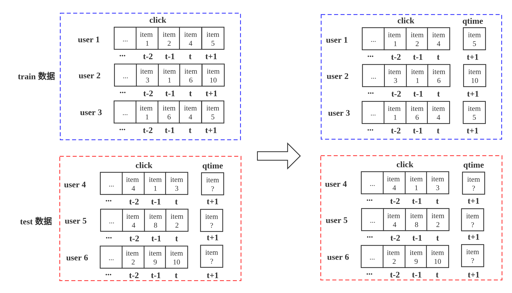
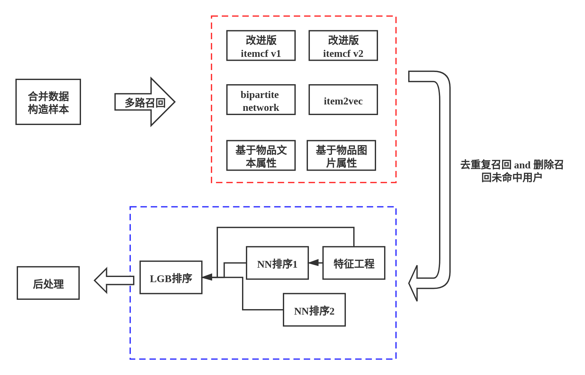
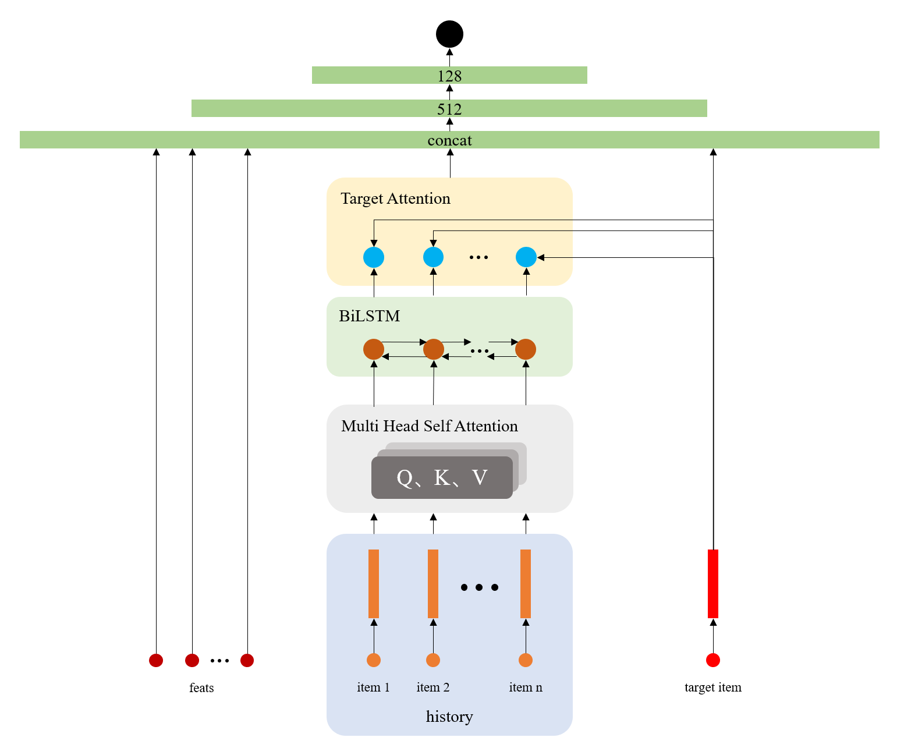
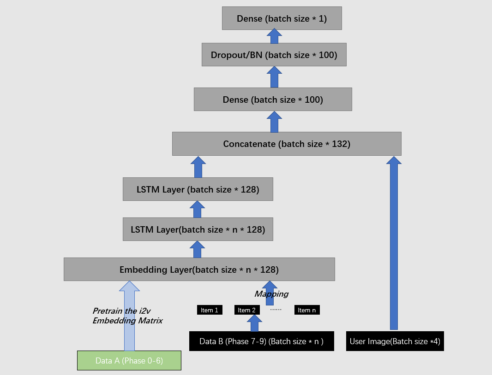

# KDD Cup 2020 Challenges for Modern E-Commerce Platform: Debiasing Top13

## 赛道链接
https://tianchi.aliyun.com/competition/entrance/231785/introduction      

## 数据集
https://pan.baidu.com/s/1bf5lpP0yqebXF4yHhHv0Lw 提取码：zf58  

**解压密码**
```  
7c2d2b8a636cbd790ff12a007907b2ba underexpose_train_click-1  
ea0ec486b76ae41ed836a8059726aa85 underexpose_train_click-2  
65255c3677a40bf4d341b0c739ad6dff underexpose_train_click-3  
c8376f1c4ed07b901f7fe5c60362ad7b underexpose_train_click-4  
63b326dc07d39c9afc65ed81002ff2ab underexpose_train_click-5  
f611f3e477b458b718223248fd0d1b55 underexpose_train_click-6  
ec191ea68e0acc367da067133869dd60 underexpose_train_click-7  
90129a980cb0a4ba3879fb9a4b177cd2 underexpose_train_click-8  
f4ff091ab62d849ba1e6ea6f7c4fb717 underexpose_train_click-9  

96d071a532e801423be614e9e8414992 underexpose_test_click-1  
503bf7a5882d3fac5ca9884d9010078c underexpose_test_click-2  
dd3de82d0b3a7fe9c55e0b260027f50f underexpose_test_click-3  
04e966e4f6c7b48f1272a53d8f9ade5d underexpose_test_click-4  
13a14563bf5528121b8aaccfa7a0dd73 underexpose_test_click-5  
dee22d5e4a7b1e3c409ea0719aa0a715 underexpose_test_click-6  
69416eedf810b56f8a01439e2061e26d underexpose_test_click-7  
55588c1cddab2fa5c63abe5c4bf020e5 underexpose_test_click-8  
caacb2c58d01757f018d6b9fee0c8095 underexpose_test_click-9 
``` 
## 模型图





## 代码说明  
> data.ipynb 数据合并；线下验证集构造   
> recall_v1.ipynb 改进itemCF  
> recall_v2.ipynb Network-based 召回(provided by [天池论坛](https://tianchi.aliyun.com/forum/postDetail?spm=5176.12586969.1002.15.6c3f29e8RAn9jZ&postId=104936))   
> recall_v3.ipynb 基于商品文本信息 ANN  
> recall_v4.ipynb 基于商品图片信息 ANN  
> recall_v5.ipynb 改进itemCF(provided by 天才儿童)  
> recall_v6.ipynb item2vec(provided by [snsxf](https://github.com/snsxf))  
> recall.ipynb 合并各路召回；删除召回未命中用户  
> rank_feature 排序阶段特征工程  
> kdd_Lstm_sort.ipynb 深度模型1((provided by [BuzzLightYear](https://github.com/yzh1994414))  
> nn_data.ipynb 构造深度模型2输入  
> nn_tiancai.py 深度模型2(provided by 天才儿童)  
> rank_model.ipynb LGB模型预测后处理输出  